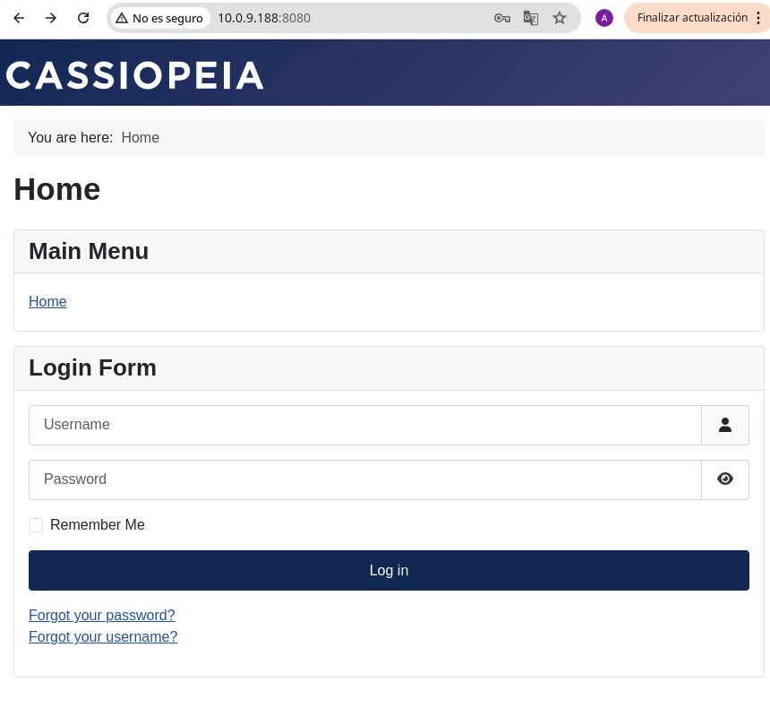
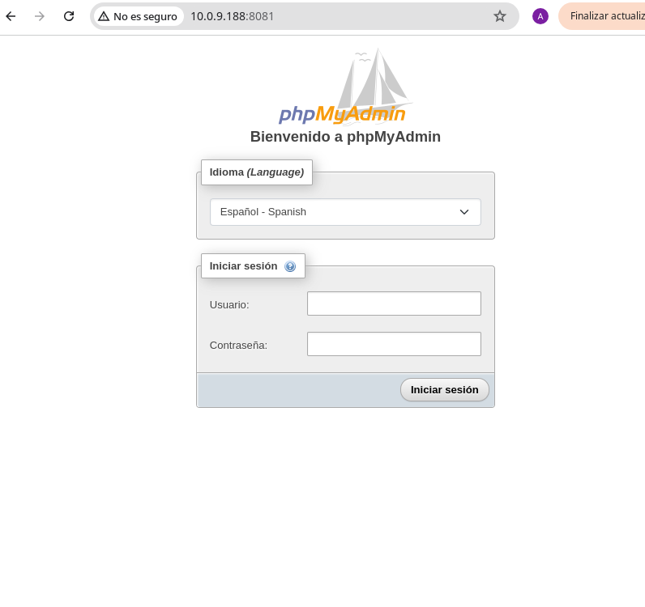
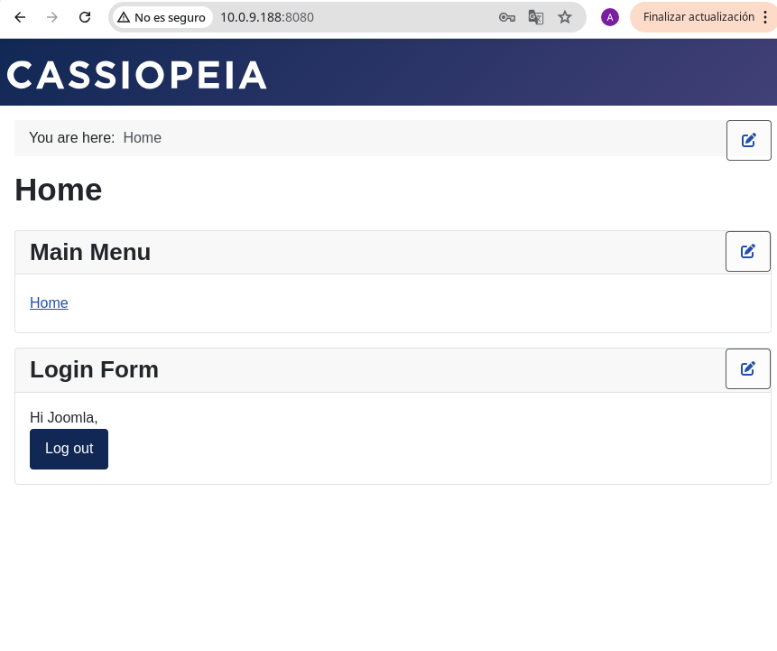
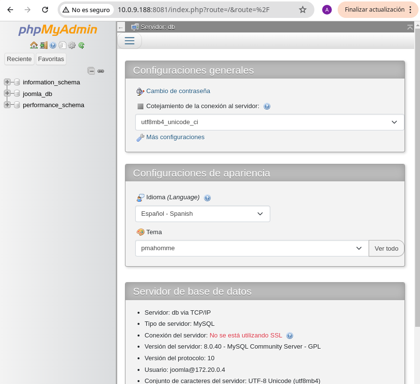

# Tarea 7

## Parte 1
**Crea un archivo docker-compose.yml que deberá incluir los siguientes servicios:**

### - Joomla:
**_La aplicación web que utilizará la base de datos MySQL para
almacenar sus datos. Debe ser accesible en el puerto 8080 y
almacenar los datos de modo persistente_**


### - MySQL: 
**_El servidor de base de datos que almacenará los datos de
Joomla. Debe tener un volumen de almacenamiento persistente.
Debes documentar cada uno de los pasos y comprobaciones creando un readme
en markdown que sirva de guía para otros usuarios, además de subir el docker
compose que creaste y explicar el por qué de la configuración del docker compose._**


## Parte 2
**Añade al docker compose el siguiente servicio.**

### - phpMyAdmin:
**Una interfaz web para gestionar la base de datos de
Joomla de forma gráfica. Debe ser accesible en el puerto 8081**

**Debes documentar cada uno de los pasos y comprobaciones añadiendoles al
readme en markdown que sirva de guía para otros usuarios, explicar el por qué de
la configuración del docker composelo**

## Ejercicio: 

### 1 - Crear un archivo docker-compose.yml

````
services:
    Joomla:
        image: joomla
        restart: always
        ports:
            - 8080:80
        environment:
            JOOMLA_DB_HOST: db
            JOOMLA_DB_USER: joomla
            JOOMLA_DB_PASSWORD: 1234
            JOOMLA_DB_NAME: joomla_db
            JOOMLA_SITE_NAME: Joomla
            JOOMLA_ADMIN_USER: Joomla
            JOOMLA_ADMIN_USERNAME: joomla
            JOOMLA_ADMIN_PASSWORD: joomla@secured
            JOOMLA_ADMIN_EMAIL: joomla@example.com
    
    db:
        image: mysql:8.0
        restart: always
        environment:
            MYSQL_DATABASE: joomla_db
            MYSQL_USER: joomla
            MYSQL_PASSWORD: 1234
            MYSQL_RANDOM_ROOT_PASSWORD: '1234'
        
    phpMyAdmin:
        image: phpmyadmin
        restart: always
        ports:
            - 8081:80
        environment:
            - PMA_ARBITRARY = 1
````

### 2 - Iniciamos el docker-compose

```` docker compose up -d ````

### 3 - Comprobamos que los servicios estén corriendo

```` docker ps ````

### 4 - Accedemos a los servicios creados

```` http://10.0.9.188:8080/ ```` Joomla



```` http://10.0.9.188:8081/ ```` phpMyAdmin



### 5 - Comprobamos servicios

Ahora podemos comprobar que los servicios funcionen correctamente, para ello vamos a la página de Joomla y accedemos como administrador con los datos que se encuentran en el archivo docker-compose.yml



Tambien podemos acceder a phpMyAdmin y comprobar que la base de datos de Joomla se haya creado correctamente

